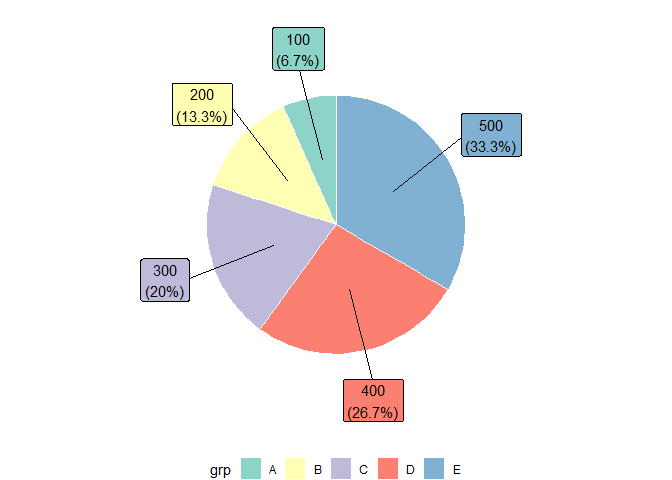
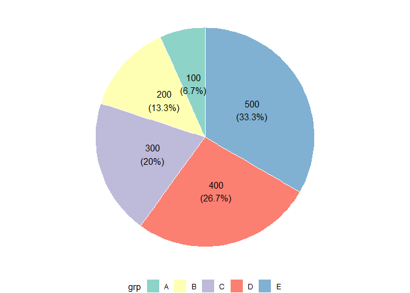
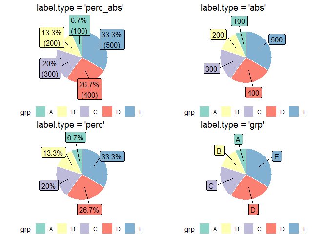
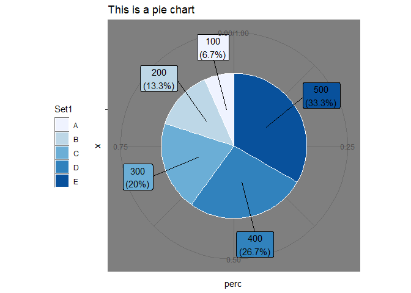

PieChart.R
================
Tobias Byland
2023-04-12

### What is this?

A function to create pie charts with ggplot2.

Takes as input a data.frame with two variables:

- grp: Names for the groups in the pie chart.

- value: Values used for the sections in the pie chart - must be
  absolute values, not percentages.

### Source the function

``` r
library(devtools)
SourceURL <- "https://raw.githubusercontent.com/kelloggs13/QuickFunctions/main/PieChart.R"
source_url(SourceURL)
```

### Default call

``` r
df.pie <- data.frame(grp=LETTERS[1:5], value = (1:5)*100) 
df.pie %>% mutate(perc = value / sum(value))
```

    ##   grp value       perc
    ## 1   A   100 0.06666667
    ## 2   B   200 0.13333333
    ## 3   C   300 0.20000000
    ## 4   D   400 0.26666667
    ## 5   E   500 0.33333333

``` r
PieChart(df.pie, grp, value)
```

<!-- -->

### Options

Labels can be placed on the inside:

``` r
PieChart(df.pie, grp, value, "inside")
```

<!-- -->

Various kind of labels can be used:

``` r
PieChart(df.pie, grp, value, label.type = "perc_abs")
PieChart(df.pie, grp, value, label.type = "abs")
PieChart(df.pie, grp, value, label.type = "perc")
PieChart(df.pie, grp, value, label.type = "grp")
```

<!-- -->

### Enhance with ggplot2

Since the function returns a ggplot2-object it can easily be modified
further:

``` r
PieChart(df.pie, grp, value) + 
  theme_dark() +  
  scale_fill_brewer("Set1") + 
  theme(legend.position = "left") + 
  ggtitle("This is a pie chart")
```

<!-- -->
